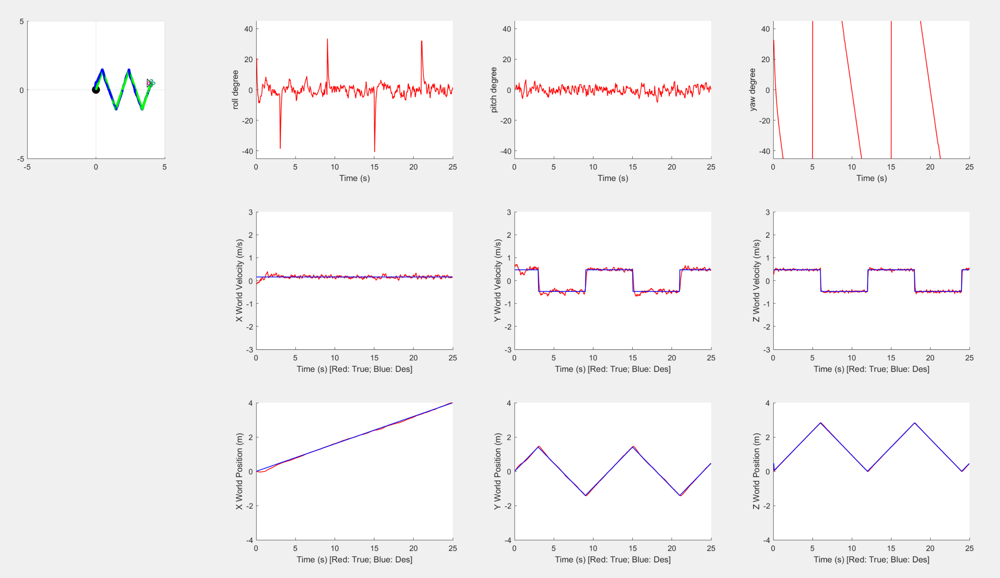
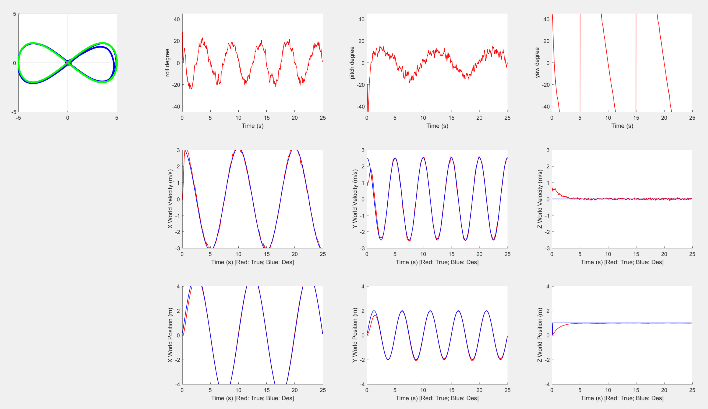
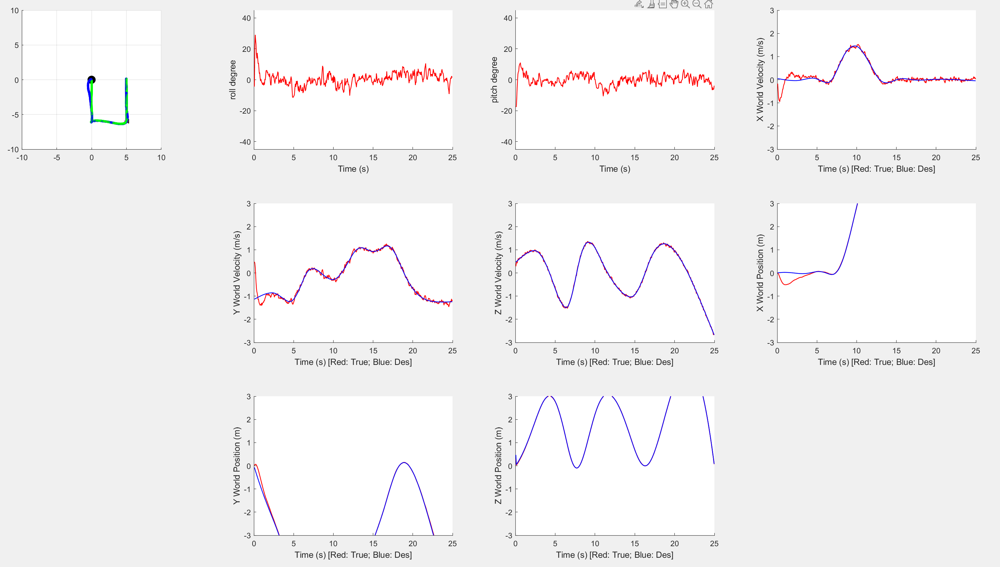
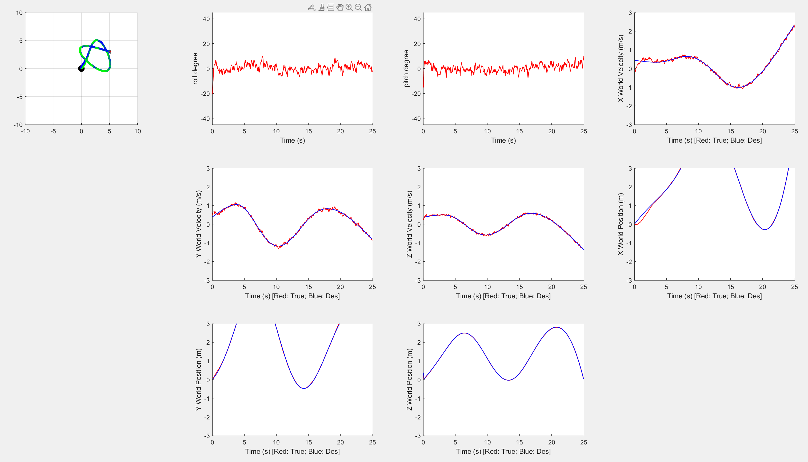
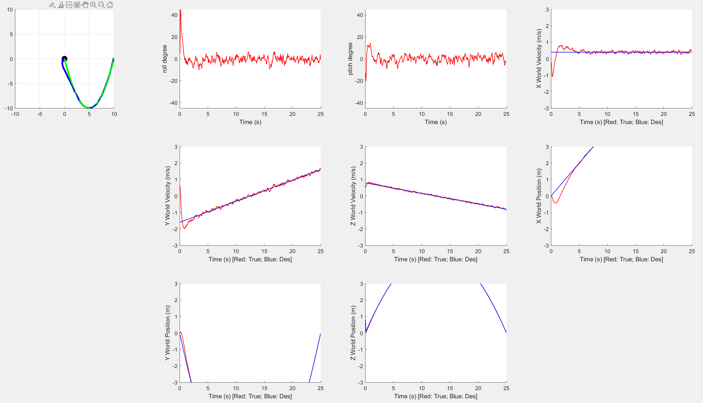

# Source code for ELEC5660-2025
——A reimplementation version of [ELEC 5660-2021 by Garyandtang](https://github.com/Garyandtang/ELEC5660-2021)
Source code of ELEC5660 Introduction to Aerial Robotics by [Prof. Shaojie Shen](https://facultyprofiles.ust.hk/profiles.php?profile=shaojie-shen-eeshaojie/) at HKUST.

C++ for Project 2-4, Matlab for Project 1.

This year we totally have 4 projects in this course, including 

- [x] Project 1 (Control and Planning)
  - [x] PID Quadrotor trajectory tracking control
  - [x] Minimum snap optimization-based trajectory generation
  - [x] Optimal path planning (A* + Dijkstra)
- [ ] Project 2 (Visual estimator)
  - [ ] 3D-2D Pose Estimation with Direct  Linear Transform (DLT)
  - [ ] Visual Odometry with Stereo Camera
- [ ] Project 3 (EKF sensor fusion)
  - [ ] EKF for quadrotor state estimation
  - [ ] Augmented EKF with imu, visual odometry, and tag detection
- [ ] Project 4 (System integration on-board the drone)

## Dataset
* Dataset of project 2 and project 3: https://hkustconnect-my.sharepoint.com/:f:/g/personal/jtangas_connect_ust_hk/EpemMUamNbFBtL2c18R_DfQBDykZWsBn9RR3IKZTftks6w?e=bQaWDb

## Project 1 (Control and Planning)

The project 1 is done in **MATLAB simulator**, where I implemented 1) Quadrotor trajectory tracking control; 2) Optimization-based trajectory generation;. 3) path planning + trajectory generation + control.

#### Phase 1 Result (PID)

#### Phase 2 Result (PID+Trajectory Generation)

#### Phase 3 Result (PID+A*+Trajectory Generation)

.png)

.png)
## Project 2 (Visual estimator)

The project 1 is done in **ROS ** with offline dataset. The code is done with C++. Two sub tasks are:

1. 3D-2D Pose Estimation with Direct  Linear Transform (DLT)
2. Visual Odometry with Stereo Camera

#### Phase 1 Result (Pose Estimation)

#### Phase 2 Result (Visual Odometry)

## Project 3 (Sensor Fusion)

The project 3 is done in **ROS ** with offline dataset. The code is done with C++. Two sub tasks are:

1. EKF for quadrotor state estimation.
2.   Augmented EKF for quadrotor state estimation with tag detection, visual odometry and IMU.

#### Phase 1 Result (EKF for Quadrotor State Estimation)

#### Phase 2 Result (Augmented EKF for Quadrotor State Estimation)

## Academic Integrity Policy

Students at Hong Kong University of Science and Technology are expected to produce their own  original academic work. Please think carefully when you are using the  codes and do not violate academic integrity policy.
